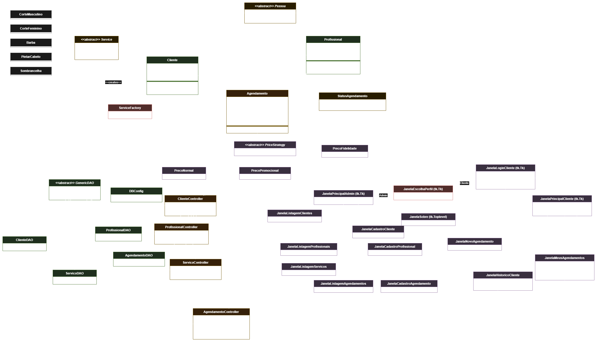

# Salão de Beleza — Sistema de Gerenciamento

Sistema de gerenciamento de salão de beleza desenvolvido em Python com interface gráfica Tkinter e persistência em banco de dados PostgreSQL, seguindo o padrão de arquitetura MVC.

-----

## Descrição Geral do Sistema

O sistema oferece dois perfis de acesso distintos:

**Administrador** — acesso completo ao sistema. Pode cadastrar e gerenciar clientes, profissionais, serviços e agendamentos sem restrições, além de alterar estratégias de preço e status dos agendamentos.

**Cliente** — acesso mediante login por CPF. Se o CPF não estiver cadastrado, o próprio cliente pode se registrar na tela de login. Após autenticar, pode criar novos agendamentos para si mesmo, cancelar reservas e consultar seu histórico de atendimentos concluídos.

O sistema controla automaticamente a disponibilidade dos profissionais, impedindo agendamentos sobrepostos com base na duração de cada serviço. Ao criar um agendamento, apenas os horários livres são exibidos, das 08h às 12h e das 13h às 17h, com slots calculados pela duração do serviço escolhido.

-----

## Funcionalidades Implementadas

- Login do cliente por CPF com cadastro inline caso não tenha conta
- CRUD completo de Clientes com busca por nome e validação de CPF único entre clientes e profissionais
- CRUD completo de Profissionais com seleção de especialidades por serviço
- Gerenciamento de Serviços, 5 tipos pré-cadastrados (Corte Masculino, Corte Feminino, Barba, Pintar Cabelo, Sobrancelha) com edição de preço pelo Admin
- CRUD completo de Agendamentos pelo Admin com controle de status e estratégia de preço
- Agendamento pelo Cliente com filtro de profissionais por especialidade e exibição de horários disponíveis
- Ciclo de vida do agendamento: `Agendado → Concluído` ou `Agendado → Cancelado`
- Histórico de atendimentos do cliente com total gasto calculado
- Tela Sobre com informações do sistema e autor

-----

## Pré-requisitos

### 1. Python

Versão recomendada: **Python 3.10+**

### 2. Bibliotecas necessárias

Instale via pip no terminal:

```bash
pip install psycopg2-binary
pip install tkcalendar
```

|Biblioteca       |Finalidade                                                     |
|-----------------|---------------------------------------------------------------|
|`psycopg2-binary`|Driver de conexão com o banco PostgreSQL                       |
|`tkcalendar`     |Calendário popup para seleção de datas nas telas de agendamento|

### 3. PostgreSQL

Instale e inicie o PostgreSQL. As configurações de conexão padrão do projeto são:

|Campo  |Valor                 |
|-------|----------------------|
|Host   |localhost             |
|Porta  |5432                  |
|Usuário|postgres              |
|Senha  |postgres              |
|Banco  |lpoo_projeto_Frederico|

Para alterar essas configurações, edite o arquivo [dao/DBConfig.py](dao/DBConfig.py).

-----

## Instruções de Execução

### Passo 1 — Criar o banco de dados

No pgAdmin, execute:

```sql
CREATE DATABASE lpoo_projeto_Frederico;
```

### Passo 2 — Criar as tabelas

Conecte-se ao banco criado e execute o arquivo [sql/CriarBanco.sql](sql/CriarBanco.sql), ou cole o SQL abaixo:

```sql
-- Clientes
CREATE TABLE IF NOT EXISTS tb_clientes (
    cli_id        SERIAL         PRIMARY KEY,
    cli_nome      VARCHAR(100)   NOT NULL,
    cli_cpf       CHAR(11)       UNIQUE NOT NULL,
    cli_telefone  VARCHAR(20)    NOT NULL,
    cli_email     VARCHAR(100)   NOT NULL
);

-- Profissionais
CREATE TABLE IF NOT EXISTS tb_profissionais (
    pro_id            SERIAL         PRIMARY KEY,
    pro_nome          VARCHAR(100)   NOT NULL,
    pro_cpf           CHAR(11)       UNIQUE NOT NULL,
    pro_especialidade VARCHAR(100)   NOT NULL
);

-- Serviços
CREATE TABLE IF NOT EXISTS tb_servicos (
    ser_id      SERIAL         PRIMARY KEY,
    ser_nome    VARCHAR(100)   NOT NULL,
    ser_tipo    VARCHAR(50)    NOT NULL,
    ser_duracao INTEGER        NOT NULL CHECK (ser_duracao > 0),
    ser_preco   NUMERIC(10,2)  NOT NULL CHECK (ser_preco > 0),
    CONSTRAINT chk_tipo_servico
        CHECK (ser_tipo IN ('cortemasculino','cortefeminino','barba',
                            'pintarcabelo','sobrancelha'))
);

-- Agendamentos
CREATE TABLE IF NOT EXISTS tb_agendamentos (
    age_id         SERIAL      PRIMARY KEY,
    age_cli_id     INTEGER     NOT NULL,
    age_pro_id     INTEGER     NOT NULL,
    age_ser_id     INTEGER     NOT NULL,
    age_data_hora  TIMESTAMP   NOT NULL,
    age_status     VARCHAR(20) NOT NULL DEFAULT 'agendado',
    age_estrategia VARCHAR(20) NOT NULL DEFAULT 'normal',
    CONSTRAINT fk_cliente
        FOREIGN KEY (age_cli_id) REFERENCES tb_clientes(cli_id) ON DELETE RESTRICT,
    CONSTRAINT fk_profissional
        FOREIGN KEY (age_pro_id) REFERENCES tb_profissionais(pro_id) ON DELETE RESTRICT,
    CONSTRAINT fk_servico
        FOREIGN KEY (age_ser_id) REFERENCES tb_servicos(ser_id) ON DELETE RESTRICT,
    CONSTRAINT chk_status
        CHECK (age_status IN ('agendado','concluido','cancelado')),
    CONSTRAINT chk_estrategia
        CHECK (age_estrategia IN ('normal','promocional','fidelidade'))
);
```

### Passo 3 — Popular os serviços

Execute o arquivo [sql/PreencherServicos.sql](sql/PreencherServicos.sql), ou cole o SQL abaixo:

```sql
INSERT INTO tb_servicos (ser_nome, ser_tipo, ser_duracao, ser_preco)
SELECT 'Corte Masculino', 'cortemasculino', 30, 50.00
WHERE NOT EXISTS (SELECT 1 FROM tb_servicos WHERE ser_tipo='cortemasculino');

INSERT INTO tb_servicos (ser_nome, ser_tipo, ser_duracao, ser_preco)
SELECT 'Corte Feminino', 'cortefeminino', 60, 80.00
WHERE NOT EXISTS (SELECT 1 FROM tb_servicos WHERE ser_tipo='cortefeminino');

INSERT INTO tb_servicos (ser_nome, ser_tipo, ser_duracao, ser_preco)
SELECT 'Barba', 'barba', 20, 35.00
WHERE NOT EXISTS (SELECT 1 FROM tb_servicos WHERE ser_tipo='barba');

INSERT INTO tb_servicos (ser_nome, ser_tipo, ser_duracao, ser_preco)
SELECT 'Pintar Cabelo', 'pintarcabelo', 120, 150.00
WHERE NOT EXISTS (SELECT 1 FROM tb_servicos WHERE ser_tipo='pintarcabelo');

INSERT INTO tb_servicos (ser_nome, ser_tipo, ser_duracao, ser_preco)
SELECT 'Sobrancelha', 'sobrancelha', 15, 25.00
WHERE NOT EXISTS (SELECT 1 FROM tb_servicos WHERE ser_tipo='sobrancelha');
```

### Passo 4 — Executar o sistema

```bash
python main.py
```

-----

## Estrutura do Projeto

```
ProjetoFinal_LPOO_Frederico/
├── main.py                              
├── README.md                            
│
├── control/
│   ├── AgendamentoController.py         # Regras de negócio dos Agendamentos
│   ├── ClienteController.py             # Regras de negócio dos Clientes
│   ├── ProfissionalController.py        # Regras de negócio dos Profissionais
│   └── ServicoController.py             # Regras de negócio dos Serviços
│
├── dao/
│   ├── AgendamentoDAO.py                # Persistência e consultas de Agendamentos
│   ├── ClienteDAO.py                    # Persistência e consultas de Clientes
│   ├── DBConfig.py                      # Configuração e conexão com PostgreSQL
│   ├── GenericoDAO.py                   # Classe abstrata com operações CRUD genéricas
│   ├── ProfissionalDAO.py               # Persistência e consultas de Profissionais
│   └── ServicoDAO.py                    # Persistência e consultas de Serviços
│
├── docs/
│   ├── ArquivoDrawio.drawio             # Arquivo de edição Drawio
│   └── DiagramaDeClasses.png            # Diagrama de classes do sistema
│
├── model/
│   ├── Agendamento.py                   # Entidade de domínio Agendamento
│   ├── Barba.py                         # Serviço concreto do tipo Barba
│   ├── Cliente.py                       # Entidade de domínio Cliente
│   ├── CorteFeminino.py                 # Serviço concreto do tipo Corte Feminino
│   ├── CorteMasculino.py                # Serviço concreto do tipo Corte Masculino
│   ├── ExcecoesPersonalizadas.py        # Exceções específicas
│   ├── Pessoa.py                        # Classe abstrata para Cliente e Profissional
│   ├── PintarCabelo.py                  # Serviço concreto do tipo Pintura de Cabelo
│   ├── PrecoFidelidade.py               # Strategy de cálculo com desconto fidelidade
│   ├── PrecoNormal.py                   # Strategy de cálculo com preço padrão
│   ├── PrecoPromocional.py              # Strategy de cálculo com desconto promocional
│   ├── PriceStrategy.py                 # Interface abstrata do padrão Strategy
│   ├── Profissional.py                  # Entidade de domínio Profissional
│   ├── Service.py                       # Classe abstrata para Serviços
│   ├── ServiceFactory.py                # Factory Method para criação de Serviços
│   ├── Sobrancelha.py                   # Serviço concreto do tipo Sobrancelha
│   └── StatusAgendamento.py             # Enum com os estados do Agendamento
│
├── sql/
│   ├── CriaBanco.sql                    # Script de criação das tabelas do banco
│   └── PreencherServicos.sql            # Script de inserção dos Serviços
│
└── views/
    ├── JanelaCadastroAgendamento.py     # Tela de cadastro de Agendamentos (Admin)
    ├── JanelaCadastroCliente.py         # Tela de cadastro de Clientes
    ├── JanelaCadastroProfissional.py    # Tela de cadastro de Profissionais
    ├── JanelaEscolhaPerfil.py           # Tela inicial para escolha de perfil
    ├── JanelaHistoricoCliente.py        # Tela de histórico de atendimentos do cliente
    ├── JanelaListagemAgendamentos.py    # Tela de listagem de Agendamentos
    ├── JanelaListagemClientes.py        # Tela de listagem de Clientes
    ├── JanelaListagemProfissionais.py   # Tela de listagem de Profissionais
    ├── JanelaListagemServicos.py        # Tela de listagem e gerenciamento de Serviços
    ├── JanelaLoginCliente.py            # Tela de autenticação do cliente via CPF
    ├── JanelaMeusAgendamentos.py        # Tela dos Agendamentos do cliente logado
    ├── JanelaNovoAgendamento.py         # Tela para novo agendamento do cliente
    ├── JanelaPrincipalAdmin.py          # Menu principal do Administrador
    ├── JanelaPrincipalCliente.py        # Menu principal do Cliente
    └── JanelaSobre.py                   # Tela com informações do sistema e autor
```

-----

## Diagrama de Classes



-----

## Padrões de Projeto Utilizados

|Padrão      |Onde é aplicado          |Descrição                                                                                                                               |
|------------|-------------------------|----------------------------------------------------------------------------------------------------------------------------------------|
|**DAO**     |`dao/`                   |Camada de persistência com operações CRUD para cada entidade.                                                                           |
|**Factory** |`model/ServiceFactory.py`|Centraliza a criação dos 5 tipos de serviço a partir de uma string, usado pelo DAO ao reconstruir objetos do banco                      |
|**Strategy**|`model/PriceStrategy.py` |Permite trocar o algoritmo de cálculo de preço (`PrecoNormal`, `PrecoPromocional`, `PrecoFidelidade`) sem alterar a classe `Agendamento`|
|**MVC**     |Estrutura geral          |Separação clara entre Model (domínio), View (Tkinter) e Controller (regras de negócio)                                                  |

-----

## Declaração de Uso de IA

- [x] **Utilizei IA** como ferramenta de apoio.
- **Ferramenta:** Claude Sonnet 4.6
- **Finalidade:** Apoio no planejamento e estruturação do projeto, definição da divisão das views e organização das responsabilidades seguindo o padrão MVC, auxílio na formatação e organização do código. Também foi utilizada para auxiliar na criação dos scripts SQL de criação e população do banco de dados, na identificação e correção de erros durante o desenvolvimento e na elaboração deste README.
- **Validação:** Todo o código gerado foi lido, compreendido e testado. As decisões de estrutura, arquitetura e padrões de projeto foram tomadas com base no conteúdo das aulas.